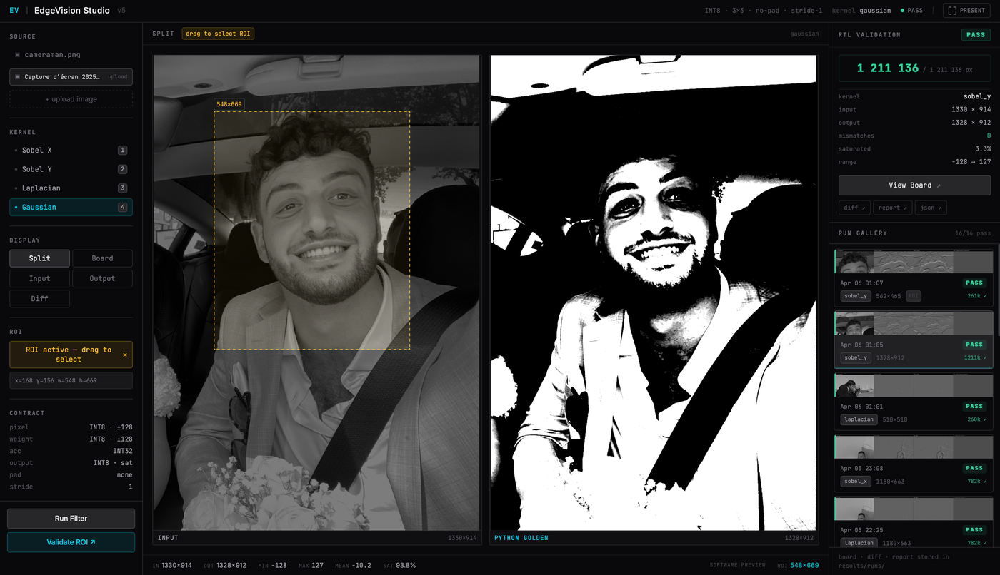
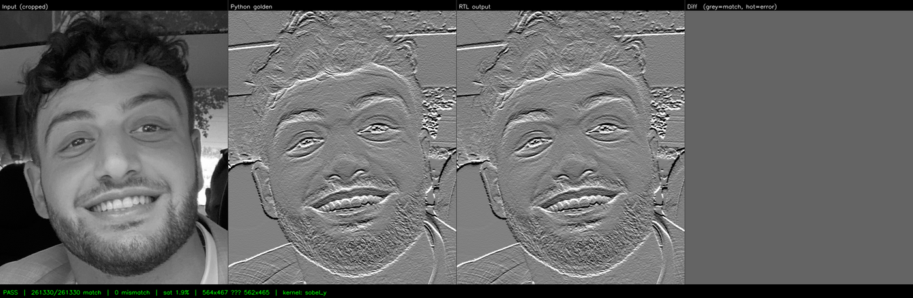

# EdgeVision Accelerator

A fixed-point hardware convolution accelerator — Python golden reference, Verilog RTL core, byte-exact verification pipeline, and an interactive visual studio.

The project is built as a **software/hardware co-design**: Python owns the numeric contract, test-vector generation, and verification; Verilog owns the compute core. Both sides solve exactly the same arithmetic. Any divergence is a bug.

---

## What it demonstrates

- A complete **INT8 3×3 convolution engine** in Verilog, with a 32-bit accumulator and saturation output
- A **Python golden reference** (`conv_reference.py`) that is the sole arithmetic authority
- An automated pipeline: Python → hex files → Icarus Verilog simulation → byte-exact comparison
- **EdgeVision Studio** — an interactive web interface to run filters, draw ROI selections, trigger RTL validation, and browse the run history with per-frame board artifacts

---

## Demo

**EdgeVision Studio** — ROI selection active, Sobel Y kernel, split view, validation PASS, run gallery:



---

**Kernel switching and RTL validation** — select a source, switch kernels, run filter, trigger RTL simulation:

<video src="https://github.com/user-attachments/assets/c5f8baed-78be-4138-ba85-80b1754cac74" controls width="100%"></video>

---

**ROI selection and RTL validation** — draw a region of interest, validate only that crop against the Verilog core:

<video src="https://github.com/user-attachments/assets/3452118f-e4bd-4073-a4d0-83e683c19b03" controls width="100%"></video>

---

**Gallery and Board Viewer** — browse run history, open the 4-panel board (Input | Python golden | RTL output | Diff map):

<video src="https://github.com/user-attachments/assets/4e44fcb4-1d15-4257-a595-1bd6e15e0b11" controls width="100%"></video>

---

**Validation artifact** — Sobel Y on a cropped ROI. Python golden and RTL output are pixel-identical. Diff map is flat gray (zero mismatches):



**Python oracle: 14/14 unit tests pass. RTL simulation: ALL PASS across all kernels and image sizes.**

---

## Architecture

```
┌────────────────────────────────────────────────────────────────────┐
│  studio/              React + TypeScript + Tailwind CSS            │
│  EdgeVision Studio — interactive visual interface (V5)             │
│  Source selection · kernel picker · ROI · run gallery · board view│
└──────────────────────────┬─────────────────────────────────────────┘
                           │  REST API  (JSON + base64 PNGs)
┌──────────────────────────▼─────────────────────────────────────────┐
│  backend/             FastAPI service                              │
│  POST /api/filter · POST /api/validate · GET /api/runs             │
│  Thin orchestration — never reimplements core logic                │
└──────────────────────────┬─────────────────────────────────────────┘
                           │  Python imports (core_bridge.py)
┌──────────────────────────▼─────────────────────────────────────────┐
│  python/              Core pipeline (V1–V4)                        │
│  common/  · golden/  · codegen/  · verify/  · visualize/          │
│  preview/ (snapshot export · RTL runner · validation reporter)     │
└──────────────────────────┬─────────────────────────────────────────┘
                           │  hex files + meta.json
┌──────────────────────────▼─────────────────────────────────────────┐
│  rtl/ + sim/          RTL simulation (locked)                      │
│  Icarus Verilog — reads hex → runs DUT → writes rtl_output.hex    │
└────────────────────────────────────────────────────────────────────┘
```

The Python and RTL layers share **no code and no runtime**. The hex file interface is the only coupling. This is intentional: if shared logic contained a bug, it would cancel out in verification.

---

## Quick start

### Dependencies

```bash
# Python CLI tools (golden reference, preview, validation pipeline)
pip3 install -r python/requirements.txt

# Backend server (FastAPI + core Python bridge)
pip3 install -r backend/requirements.txt

# RTL simulator (macOS)
brew install icarus-verilog

# Studio frontend (Node 18+)
cd studio && npm install
```

> `scikit-image` is **not required** for any documented workflow — `data/cameraman.png`
> is included in the repo. It is only needed as a fallback if running
> `python/visualize/run_filter.py` without an `--image` argument.

### Run EdgeVision Studio

```bash
# 1. Start the backend (from project root)
cd backend
uvicorn main:app --reload --port 8000

# 2. Start the frontend (separate terminal, from project root)
cd studio
npm run dev
# → http://localhost:5173
```

Select a source image, pick a kernel, click **Run Filter** for a software preview, then **Validate RTL** to run the full simulation and compare Python golden vs Verilog output.

### Run the CLI pipeline

```bash
# Verify the Python oracle
python3 -m pytest python/golden/test_conv_reference.py -v

# Static visual demo (no simulator needed)
python3 python/visualize/run_filter.py --image data/cameraman.png --kernel sobel_x

# Full pipeline: Python → hex → RTL → verify
bash scripts/demo.sh --image data/cameraman.png --kernel sobel_x

# Interactive preview (image or video)
python3 python/preview/preview.py --image data/cameraman.png
# Controls: 1/2/3/4 = kernel · S = save snapshot · Q = quit

# Per-frame RTL validation from CLI
python3 python/preview/validate_snapshot.py --image data/cameraman.png --kernel sobel_x
python3 python/preview/validate_snapshot.py --image data/cameraman.png \
    --roi 100 80 96 96 --kernel laplacian
```

---

## Repository layout

```
edgevision-accelerator/
├── data/
│   └── cameraman.png               ← standard 512×512 grayscale test image
│
├── python/
│   ├── common/
│   │   ├── kernels.py              ← named INT8 kernel definitions (single source of truth)
│   │   ├── hex_io.py               ← hex file read/write shared by pipeline + RTL
│   │   └── conversions.py          ← uint8 ↔ int8 with display conversion
│   ├── golden/
│   │   ├── conv_reference.py       ← INT8 convolution oracle (no dependencies)
│   │   └── test_conv_reference.py  ← 14 unit tests
│   ├── codegen/
│   │   └── gen_test_vectors.py     ← random or image → hex test vectors
│   ├── visualize/
│   │   └── run_filter.py           ← static demo: PNG in → filter → PNG out
│   ├── verify/
│   │   └── compare_outputs.py      ← diff RTL vs golden, report + figure
│   └── preview/
│       ├── preview.py              ← interactive CLI entry point (image/video)
│       ├── preview_engine.py       ← filter + display event loop
│       ├── input_handler.py        ← image/video loading and frame resize
│       ├── artifact_handler.py     ← snapshot saving
│       ├── snapshot_exporter.py    ← frame/ROI → hex files for RTL validation
│       ├── rtl_runner.py           ← invokes sim/run_sim.sh, collects output
│       ├── validate_snapshot.py    ← CLI: full validation pipeline per frame
│       └── validation_reporter.py  ← diff map, board PNG, report.json/txt
│
├── rtl/
│   ├── src/
│   │   ├── mac.v                   ← combinational signed 8×8 → 32-bit multiply
│   │   └── conv3x3.v               ← 9× MAC + INT32 accumulator + INT8 saturation
│   └── tb/
│       └── conv_tb.v               ← $readmemh, drives DUT, writes rtl_output.hex
│
├── sim/
│   └── run_sim.sh                  ← Icarus Verilog runner (reads meta.json for dims)
│
├── backend/
│   ├── main.py                     ← FastAPI app, CORS, route mounting
│   ├── core_bridge.py              ← Python path setup for core imports
│   ├── requirements.txt
│   └── routes/
│       ├── filter.py               ← POST /api/filter (software preview)
│       ├── validate.py             ← POST /api/validate (RTL validation pipeline)
│       ├── runs.py                 ← GET /api/runs (artifact retrieval)
│       └── media.py                ← GET /api/media (list data/ sources)
│
├── studio/                         ← EdgeVision Studio (React/TypeScript/Tailwind)
│   └── src/
│       ├── App.tsx                 ← state hub, orchestration
│       ├── api/client.ts           ← typed API wrappers
│       ├── types/index.ts          ← shared type definitions
│       └── components/
│           ├── layout/             ← Header, PresentationBar
│           ├── sidebar/            ← ControlPanel (source · kernel · ROI · actions)
│           ├── workspace/          ← VisualWorkspace, ImagePanel, RoiSelector
│           ├── validation/         ← ValidationPanel (RTL status + metrics)
│           ├── gallery/            ← RunGallery (browsable run history)
│           └── board/              ← BoardViewer (full-screen artifact overlay)
│
├── scripts/
│   └── demo.sh                     ← end-to-end CLI pipeline in one command
│
├── docs/
│   ├── fixed_point.md              ← numeric contract (Python + RTL must agree)
│   └── architecture_v5.md          ← Studio layer model and API boundaries
│
└── results/                        ← demo assets + run artifacts
    ├── cameraman_input.png         ← committed: README demo asset
    ├── cameraman_sobel_x_python.png ← committed: README demo asset
    └── runs/<run_id>/              ← generated: board.png, diff_map.png, report.*
```

---

## Fixed-point contract

| Signal | Type | Width | Range |
|---|---|---|---|
| Input pixel | Signed integer | 8 bit | −128 to +127 |
| Kernel weight | Signed integer | 8 bit | −128 to +127 |
| Accumulator | Signed integer | 32 bit | full INT32 |
| Output pixel | Signed integer | 8 bit | −128 to +127 (saturated) |

- No padding · stride 1 · output shape: `(H−2) × (W−2)`
- Saturation clamp, not wraparound — matches RTL `conv3x3.v` exactly
- No bias, no activation

See [`docs/fixed_point.md`](docs/fixed_point.md) for the full specification and Verilog type conventions.

---

## Kernels

| Name | Description | Typical use |
|---|---|---|
| `sobel_x` | Horizontal gradient (detects vertical edges) | Edge detection |
| `sobel_y` | Vertical gradient (detects horizontal edges) | Edge detection |
| `laplacian` | Second derivative (sharpens all edges) | Feature emphasis |
| `gaussian` | Unnormalized 3×3 blur approximation | Smoothing |

All kernels are INT8-compatible — no division, no floating-point at any stage.

---

## Verification status

| Component | Status |
|---|---|
| Fixed-point contract | Locked — `docs/fixed_point.md` |
| Python oracle | 14/14 unit tests pass |
| Test vector generator | Random mode + image mode |
| RTL — MAC unit | Combinational, signed 8×8→32 |
| RTL — conv3x3 engine | 9× MAC + accumulator + INT8 saturation, 1-cycle |
| RTL — testbench | `$readmemh`, auto-parameterized via `meta.json` |
| End-to-end simulation | ALL PASS — verified across kernels and image sizes |
| Interactive preview | Image + video, live kernel switching |
| Snapshot validation | Frame/ROI → RTL proof → board PNG + report |
| EdgeVision Studio | Running — filter · validate · gallery · board view |

---

## Validation artifacts

Each RTL validation run produces a directory under `results/runs/<run_id>/`:

```
results/runs/20260405_183557_sobel_x/
├── sim/
│   ├── input.hex       ← input frame pixels (INT8, hex)
│   ├── kernel.hex      ← kernel weights (INT8, hex)
│   ├── expected.hex    ← Python golden output
│   ├── rtl_output.hex  ← Verilog DUT output
│   └── meta.json       ← dimensions, kernel name, ROI flag
├── source.png          ← input frame (display-ready)
├── board.png           ← 4-panel: Input | Python | RTL | Diff
├── diff_map.png        ← per-pixel mismatch heatmap
├── report.json         ← structured metrics
└── report.txt          ← human-readable summary
```

The board and diff map are viewable directly in EdgeVision Studio. A run where every pixel matches produces a flat gray diff map (zero mismatches).

---

## Design rationale

**Why INT8?**
Quantized inference is the standard for edge deployment (TFLite, ONNX Runtime, TensorRT). INT8 is the natural hardware type for inference accelerators.

**Why saturation instead of wraparound?**
Wraparound silently corrupts results — a value of +128 wrapping to −128 produces no error signal. Saturation clamps at the boundary, which is a visible and debuggable failure mode. The RTL and Python must agree on this behavior exactly.

**Why no padding in the core?**
Padding is a software policy. The hardware core is fully specified without it. Zero-padding can be applied as a pre-processing step with no RTL change required.

**Why is `sim/` the only coupling between Python and RTL?**
The hex file interface enforces a hard boundary. If Python used the RTL simulator to validate itself, bugs in shared logic would cancel out. The independence is the proof.

**Why does the backend never reimplement core logic?**
`backend/core_bridge.py` imports directly from `python/`. The backend is a thin orchestration layer. If an algorithm ever needed to change, there is one place to change it.

---

## Roadmap

| Version | Scope | Status |
|---|---|---|
| **V1** | Fixed-point contract, Python oracle, RTL core, end-to-end verification | ✓ complete |
| **V2** | Real image pipeline, static visual demo (PNG in/out) | ✓ complete |
| **V3** | Reproducible demo pipeline (`demo.sh`), validation report, clean repo | ✓ complete |
| **V4** | Interactive preview (image/video), per-frame RTL snapshot validation | ✓ complete |
| **V5** | EdgeVision Studio — web interface, REST API, run gallery, board viewer | ✓ complete |
| V6+ | Synthesis results (Yosys), timing reports, AXI-Stream interface, FPGA | planned |
